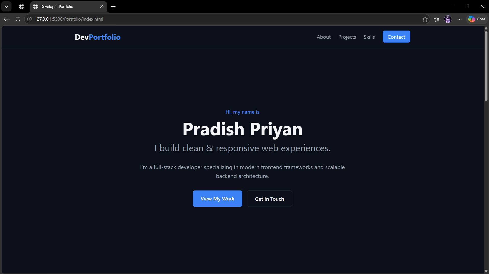
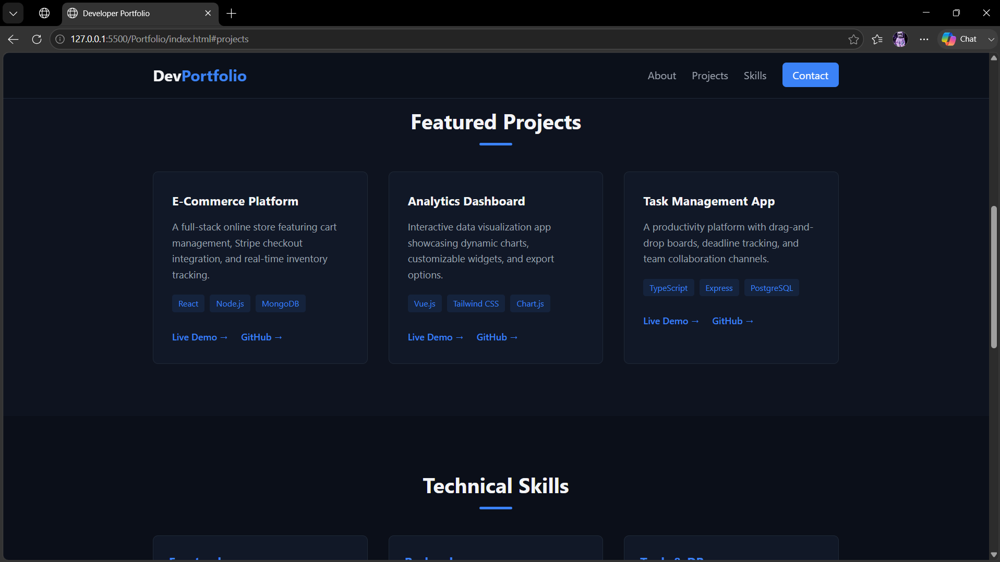
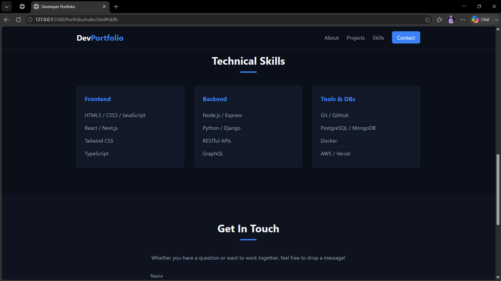
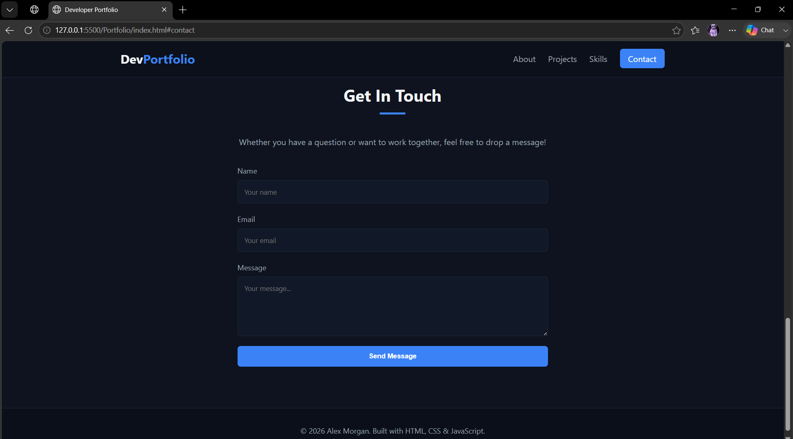

# Ex01 Portfolio
## Date:28/07/2026

## AIM
To create a Portfolio using HTML and CSS.

## ALGORITHM
### STEP 1
Create an HTML file (index.html)

### STEP 2
Create a CSS file (style.css)

### STEP 3
Include a navigation bar with links to different sections.

### STEP 4
Add structured sections for introduction, about, projects, and contact details.

### STEP 5
Define global styles for fonts, colors, and layout.

### STEP 6
Style the header, navigation bar, and sections.

### STEP 7
Use Flexbox or CSS Grid for layout design.

### STEP 8
Add hover effects and transitions for interactivity.

### STEP 9
Add Images and Media.

### STEP 10
Use optimized images for a professional look.

### STEP 11
Open the HTML file in a browser to check layout and functionality.

### STEP 12
Fix styling issues and refine content placement.

### STEP 13
Deploy the Portfolio.

### STEP 14
Upload to GitHub Pages for free hosting.

## PROGRAM
### index.html
```html
<!DOCTYPE html>
<html lang="en">
<head>
  <meta charset="UTF-8" />
  <meta name="viewport" content="width=device-width, initial-scale=1.0" />
  <title>Developer Portfolio</title>
  <link rel="stylesheet" href="style.css" />
</head>
<body>

  <!-- Navigation -->
  <nav class="navbar">
    <div class="nav-container">
      <a href="#" class="logo">Dev<span>Portfolio</span></a>
      
      <button class="menu-toggle" id="menu-toggle" aria-label="Toggle Navigation">
        ☰
      </button>

      <ul class="nav-links" id="nav-links">
        <li><a href="#about">About</a></li>
        <li><a href="#projects">Projects</a></li>
        <li><a href="#skills">Skills</a></li>
        <li><a href="#contact" class="btn-nav">Contact</a></li>
      </ul>
    </div>
  </nav>

  <!-- Hero / About Section -->
  <section id="about" class="hero">
    <div class="hero-content">
      <p class="tagline">Hi, my name is</p>
      <h1>Pradish Priyan</h1>
      <h2>I build clean & responsive web experiences.</h2>
      <p class="description">
        I'm a full-stack developer specializing in modern frontend frameworks and scalable backend architecture.
      </p>
      <div class="hero-buttons">
        <a href="#projects" class="btn btn-primary">View My Work</a>
        <a href="#contact" class="btn btn-secondary">Get In Touch</a>
      </div>
    </div>
  </section>

  <!-- Projects Section -->
  <section id="projects" class="projects-section">
    <div class="container">
      <h2 class="section-title">Featured Projects</h2>
      <div class="projects-grid">
        
        <!-- Project 1 -->
        <article class="project-card">
          <div class="project-info">
            <h3>E-Commerce Platform</h3>
            <p>A full-stack online store featuring cart management, Stripe checkout integration, and real-time inventory tracking.</p>
            <div class="tags">
              <span>React</span>
              <span>Node.js</span>
              <span>MongoDB</span>
            </div>
            <div class="project-links">
              <a href="#" target="_blank" rel="noopener">Live Demo &rarr;</a>
              <a href="#" target="_blank" rel="noopener">GitHub &rarr;</a>
            </div>
          </div>
        </article>

        <!-- Project 2 -->
        <article class="project-card">
          <div class="project-info">
            <h3>Analytics Dashboard</h3>
            <p>Interactive data visualization app showcasing dynamic charts, customizable widgets, and export options.</p>
            <div class="tags">
              <span>Vue.js</span>
              <span>Tailwind CSS</span>
              <span>Chart.js</span>
            </div>
            <div class="project-links">
              <a href="#" target="_blank" rel="noopener">Live Demo &rarr;</a>
              <a href="#" target="_blank" rel="noopener">GitHub &rarr;</a>
            </div>
          </div>
        </article>

        <!-- Project 3 -->
        <article class="project-card">
          <div class="project-info">
            <h3>Task Management App</h3>
            <p>A productivity platform with drag-and-drop boards, deadline tracking, and team collaboration channels.</p>
            <div class="tags">
              <span>TypeScript</span>
              <span>Express</span>
              <span>PostgreSQL</span>
            </div>
            <div class="project-links">
              <a href="#" target="_blank" rel="noopener">Live Demo &rarr;</a>
              <a href="#" target="_blank" rel="noopener">GitHub &rarr;</a>
            </div>
          </div>
        </article>

      </div>
    </div>
  </section>

  <!-- Skills Section -->
  <section id="skills" class="skills-section">
    <div class="container">
      <h2 class="section-title">Technical Skills</h2>
      <div class="skills-grid">
        <div class="skill-category">
          <h3>Frontend</h3>
          <ul>
            <li>HTML5 / CSS3 / JavaScript</li>
            <li>React / Next.js</li>
            <li>Tailwind CSS</li>
            <li>TypeScript</li>
          </ul>
        </div>
        <div class="skill-category">
          <h3>Backend</h3>
          <ul>
            <li>Node.js / Express</li>
            <li>Python / Django</li>
            <li>RESTful APIs</li>
            <li>GraphQL</li>
          </ul>
        </div>
        <div class="skill-category">
          <h3>Tools & DBs</h3>
          <ul>
            <li>Git / GitHub</li>
            <li>PostgreSQL / MongoDB</li>
            <li>Docker</li>
            <li>AWS / Vercel</li>
          </ul>
        </div>
      </div>
    </div>
  </section>

  <!-- Contact Section -->
  <section id="contact" class="contact-section">
    <div class="container">
      <h2 class="section-title">Get In Touch</h2>
      <p class="contact-intro">Whether you have a question or want to work together, feel free to drop a message!</p>
      
      <form class="contact-form" id="contact-form">
        <div class="form-group">
          <label for="name">Name</label>
          <input type="text" id="name" required placeholder="Your name" />
        </div>
        <div class="form-group">
          <label for="email">Email</label>
          <input type="email" id="email" required placeholder="Your email" />
        </div>
        <div class="form-group">
          <label for="message">Message</label>
          <textarea id="message" rows="5" required placeholder="Your message..."></textarea>
        </div>
        <button type="submit" class="btn btn-primary">Send Message</button>
      </form>
    </div>
  </section>

  <!-- Footer -->
  <footer>
    <p>&copy; 2026 Alex Morgan. Built with HTML, CSS & JavaScript.</p>
  </footer>

  <script src="script.js"></script>
</body>
</html>
```
### style.css
```css
/* Variables & Reset */
:root {
  --bg-color: #0b0f19;
  --card-bg: #111827;
  --text-main: #f3f4f6;
  --text-muted: #9ca3af;
  --accent: #3b82f6;
  --accent-hover: #2563eb;
  --border: #1f2937;
  --font: -apple-system, BlinkMacSystemFont, "Segoe UI", Roboto, sans-serif;
}

* {
  margin: 0;
  padding: 0;
  box-sizing: border-box;
}

html {
  scroll-behavior: smooth;
}

body {
  font-family: var(--font);
  background-color: var(--bg-color);
  color: var(--text-main);
  line-height: 1.6;
}

.container {
  max-width: 1100px;
  margin: 0 auto;
  padding: 0 1.5rem;
}

.section-title {
  font-size: 2rem;
  text-align: center;
  margin-bottom: 2.5rem;
  position: relative;
}

.section-title::after {
  content: '';
  display: block;
  width: 50px;
  height: 4px;
  background: var(--accent);
  margin: 0.5rem auto 0;
  border-radius: 2px;
}

/* Navbar */
.navbar {
  position: fixed;
  top: 0;
  width: 100%;
  background: rgba(11, 15, 25, 0.9);
  backdrop-filter: blur(10px);
  border-bottom: 1px solid var(--border);
  z-index: 1000;
}

.nav-container {
  max-width: 1100px;
  margin: 0 auto;
  padding: 1rem 1.5rem;
  display: flex;
  justify-content: space-between;
  align-items: center;
}

.logo {
  font-size: 1.5rem;
  font-weight: 700;
  color: var(--text-main);
  text-decoration: none;
}

.logo span {
  color: var(--accent);
}

.nav-links {
  display: flex;
  list-style: none;
  gap: 1.5rem;
  align-items: center;
}

.nav-links a {
  color: var(--text-muted);
  text-decoration: none;
  transition: color 0.3s;
}

.nav-links a:hover {
  color: var(--text-main);
}

.btn-nav {
  background-color: var(--accent);
  color: #fff !important;
  padding: 0.5rem 1rem;
  border-radius: 6px;
}

.btn-nav:hover {
  background-color: var(--accent-hover);
}

.menu-toggle {
  display: none;
  background: none;
  border: none;
  color: var(--text-main);
  font-size: 1.5rem;
  cursor: pointer;
}

/* Hero Section */
.hero {
  min-height: 100vh;
  display: flex;
  align-items: center;
  justify-content: center;
  padding: 6rem 1.5rem 3rem;
  text-align: center;
}

.hero-content {
  max-width: 700px;
}

.tagline {
  color: var(--accent);
  font-weight: 600;
  margin-bottom: 0.5rem;
}

.hero h1 {
  font-size: 3.5rem;
  line-height: 1.1;
  margin-bottom: 0.5rem;
}

.hero h2 {
  font-size: 1.8rem;
  color: var(--text-muted);
  font-weight: 400;
  margin-bottom: 1.5rem;
}

.description {
  color: var(--text-muted);
  font-size: 1.1rem;
  margin-bottom: 2rem;
}

.hero-buttons {
  display: flex;
  gap: 1rem;
  justify-content: center;
}

/* Buttons */
.btn {
  padding: 0.75rem 1.5rem;
  border-radius: 6px;
  text-decoration: none;
  font-weight: 600;
  transition: all 0.3s ease;
}

.btn-primary {
  background-color: var(--accent);
  color: #fff;
}

.btn-primary:hover {
  background-color: var(--accent-hover);
}

.btn-secondary {
  border: 1px solid var(--border);
  color: var(--text-main);
}

.btn-secondary:hover {
  background-color: var(--card-bg);
}

/* Projects */
.projects-section {
  padding: 5rem 0;
  background: rgba(17, 24, 39, 0.4);
}

.projects-grid {
  display: grid;
  grid-template-columns: repeat(auto-fit, minmax(300px, 1fr));
  gap: 2rem;
}

.project-card {
  background: var(--card-bg);
  border: 1px solid var(--border);
  border-radius: 8px;
  padding: 1.8rem;
  transition: transform 0.3s ease, border-color 0.3s ease;
}

.project-card:hover {
  transform: translateY(-5px);
  border-color: var(--accent);
}

.project-info h3 {
  margin-bottom: 0.8rem;
}

.project-info p {
  color: var(--text-muted);
  font-size: 0.95rem;
  margin-bottom: 1.2rem;
}

.tags {
  display: flex;
  gap: 0.5rem;
  flex-wrap: wrap;
  margin-bottom: 1.5rem;
}

.tags span {
  background: rgba(59, 130, 246, 0.1);
  color: var(--accent);
  padding: 0.2rem 0.6rem;
  border-radius: 4px;
  font-size: 0.8rem;
}

.project-links a {
  color: var(--accent);
  text-decoration: none;
  font-weight: 600;
  font-size: 0.9rem;
  margin-right: 1rem;
}

/* Skills */
.skills-section {
  padding: 5rem 0;
}

.skills-grid {
  display: grid;
  grid-template-columns: repeat(auto-fit, minmax(250px, 1fr));
  gap: 2rem;
}

.skill-category {
  background: var(--card-bg);
  border: 1px solid var(--border);
  padding: 1.5rem;
  border-radius: 8px;
}

.skill-category h3 {
  color: var(--accent);
  margin-bottom: 1rem;
}

.skill-category ul {
  list-style: none;
}

.skill-category li {
  color: var(--text-muted);
  padding: 0.4rem 0;
  border-bottom: 1px solid var(--border);
}

.skill-category li:last-child {
  border-bottom: none;
}

/* Contact */
.contact-section {
  padding: 5rem 0;
  background: rgba(17, 24, 39, 0.4);
}

.contact-intro {
  text-align: center;
  color: var(--text-muted);
  margin-bottom: 2rem;
}

.contact-form {
  max-width: 600px;
  margin: 0 auto;
  display: flex;
  flex-direction: column;
  gap: 1.2rem;
}

.form-group {
  display: flex;
  flex-direction: column;
  gap: 0.4rem;
}

.form-group label {
  color: var(--text-muted);
  font-size: 0.9rem;
}

.form-group input,
.form-group textarea {
  background: var(--card-bg);
  border: 1px solid var(--border);
  color: var(--text-main);
  padding: 0.8rem;
  border-radius: 6px;
  font-family: inherit;
}

.form-group input:focus,
.form-group textarea:focus {
  outline: none;
  border-color: var(--accent);
}

.contact-form button {
  cursor: pointer;
  border: none;
}

/* Footer */
footer {
  text-align: center;
  padding: 2rem;
  border-top: 1px solid var(--border);
  color: var(--text-muted);
  font-size: 0.9rem;
}

/* Mobile Responsive */
@media (max-width: 768px) {
  .menu-toggle {
    display: block;
  }

  .nav-links {
    display: none;
    position: absolute;
    top: 100%;
    left: 0;
    width: 100%;
    background: var(--bg-color);
    flex-direction: column;
    padding: 1.5rem;
    border-bottom: 1px solid var(--border);
  }

  .nav-links.active {
    display: flex;
  }

  .hero h1 {
    font-size: 2.5rem;
  }

  .hero h2 {
    font-size: 1.3rem;
  }
}
```
## OUTPUT





## RESULT
The program for creating Portfolio using HTML and CSS is executed successfully.
